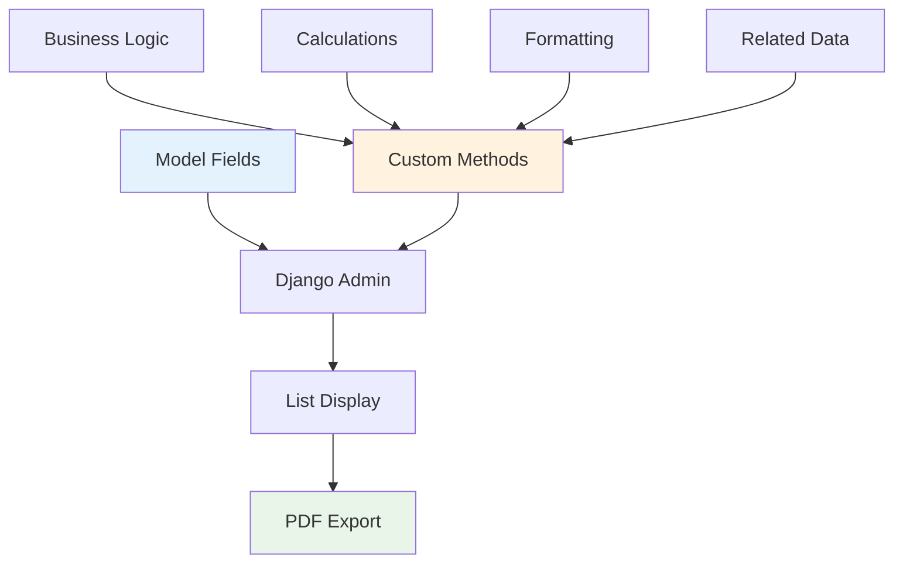
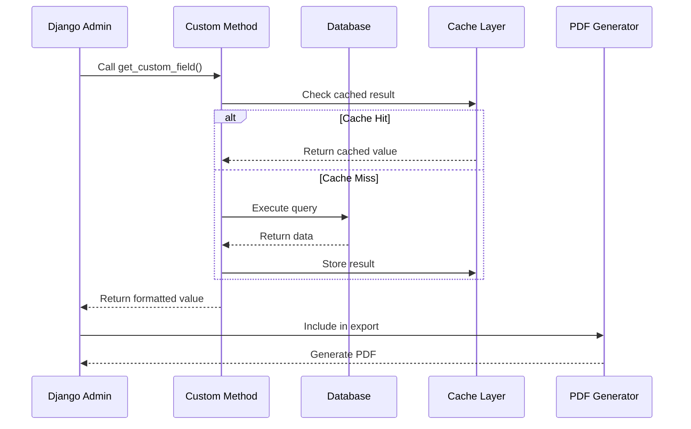

# Custom Admin Methods Guide

Master the art of creating powerful custom admin methods that seamlessly integrate with Django PDF Actions for enhanced business intelligence.

## 🎯 Understanding Custom Admin Methods

Custom admin methods allow you to add computed fields, formatted data, and business logic to your Django admin list views and PDF exports.



## 📋 Basic Custom Method Structure

### Standard Method Template

```python
def get_custom_field(self, obj):
    """
    Custom method description
    """
    # Your logic here
    return "Formatted result"

# Method configuration
get_custom_field.short_description = 'Display Name'  # Column header
get_custom_field.admin_order_field = 'model_field'   # Enable sorting (optional)
get_custom_field.boolean = False                     # Boolean field styling (optional)
get_custom_field.allow_tags = False                  # Allow HTML tags (deprecated)
```

### Essential Components

=== "📝 Method Name"
    - Use descriptive names starting with `get_`
    - Follow Python naming conventions
    - Be specific about what the method returns

=== "📖 Documentation"
    - Add docstring explaining the method's purpose
    - Document any complex logic or calculations
    - Include parameter descriptions if applicable

=== "🏷️ Configuration"
    - Set `short_description` for column headers
    - Use `admin_order_field` to enable sorting
    - Configure display options as needed

## 🔧 Common Custom Method Patterns

### 1. Data Formatting Methods

```python
class ProductAdmin(admin.ModelAdmin):
    list_display = ('name', 'get_price_formatted', 'get_status_display', 'get_category_info')
    
    def get_price_formatted(self, obj):
        """Format price with currency and styling"""
        if obj.price >= 1000:
            return f"${obj.price:,.2f} 💰"
        elif obj.price >= 100:
            return f"${obj.price:.2f} 💵"
        else:
            return f"${obj.price:.2f}"
    get_price_formatted.short_description = 'السعر'  # Arabic: Price
    get_price_formatted.admin_order_field = 'price'
    
    def get_status_display(self, obj):
        """Enhanced status display with icons"""
        status_icons = {
            'active': '✅ Active',
            'inactive': '❌ Inactive', 
            'pending': '⏳ Pending',
            'discontinued': '🚫 Discontinued'
        }
        return status_icons.get(obj.status, f"❓ {obj.status}")
    get_status_display.short_description = 'الحالة'  # Arabic: Status
    
    def get_category_info(self, obj):
        """Display category with additional info"""
        if obj.category:
            return f"{obj.category.name} ({obj.category.code})"
        return "No Category"
    get_category_info.short_description = 'Category'
    get_category_info.admin_order_field = 'category__name'
```

### 2. Calculation Methods

```python
class EmployeeAdmin(admin.ModelAdmin):
    list_display = ('name', 'get_tenure', 'get_performance_score', 'get_salary_grade')
    
    def get_tenure(self, obj):
        """Calculate employee tenure"""
        from datetime import date
        today = date.today()
        tenure = today - obj.hire_date
        
        years = tenure.days // 365
        months = (tenure.days % 365) // 30
        
        if years > 0:
            return f"{years}y {months}m"
        elif months > 0:
            return f"{months}m"
        else:
            return f"{tenure.days}d"
    get_tenure.short_description = 'مدت خدمت'  # Arabic: Service Period
    get_tenure.admin_order_field = 'hire_date'
    
    def get_performance_score(self, obj):
        """Calculate performance score based on multiple factors"""
        # Example calculation
        base_score = 70
        tenure_bonus = min((date.today() - obj.hire_date).days // 365 * 2, 20)
        department_bonus = 5 if obj.department.code == 'TECH' else 0
        
        total_score = base_score + tenure_bonus + department_bonus
        
        if total_score >= 90:
            return f"⭐ {total_score}% (Excellent)"
        elif total_score >= 80:
            return f"✅ {total_score}% (Good)"
        elif total_score >= 70:
            return f"📊 {total_score}% (Average)"
        else:
            return f"📉 {total_score}% (Needs Improvement)"
    get_performance_score.short_description = 'Performance'
    
    def get_salary_grade(self, obj):
        """Categorize salary into grades"""
        if obj.salary >= 120000:
            return "Grade A (Executive)"
        elif obj.salary >= 80000:
            return "Grade B (Senior)"
        elif obj.salary >= 50000:
            return "Grade C (Mid-level)"
        else:
            return "Grade D (Entry)"
    get_salary_grade.short_description = 'درجة الراتب'  # Arabic: Salary Grade
```

### 3. Related Data Methods

```python
class OrderAdmin(admin.ModelAdmin):
    list_display = ('order_id', 'get_customer_info', 'get_items_summary', 'get_shipping_status')
    
    def get_customer_info(self, obj):
        """Get comprehensive customer information"""
        customer = obj.customer
        company_info = f" ({customer.company})" if customer.company else ""
        return f"{customer.name}{company_info} - {customer.email}"
    get_customer_info.short_description = 'معلومات العميل'  # Arabic: Customer Info
    get_customer_info.admin_order_field = 'customer__name'
    
    def get_items_summary(self, obj):
        """Summarize order items"""
        items = obj.orderitem_set.all()
        total_items = sum(item.quantity for item in items)
        unique_products = items.count()
        
        return f"{total_items} items ({unique_products} products)"
    get_items_summary.short_description = 'Items Summary'
    
    def get_shipping_status(self, obj):
        """Get shipping status with estimated delivery"""
        if obj.shipping_date:
            days_shipped = (date.today() - obj.shipping_date).days
            if days_shipped <= 1:
                return "🚚 In Transit (Just shipped)"
            elif days_shipped <= 3:
                return f"📦 In Transit ({days_shipped} days)"
            else:
                return f"⏰ Delayed ({days_shipped} days)"
        else:
            return "📋 Processing"
    get_shipping_status.short_description = 'حالة الشحن'  # Arabic: Shipping Status
```

## 🌍 Multi-Language Custom Methods

### Bilingual Display Methods

```python
class ProductAdmin(admin.ModelAdmin):
    list_display = ('sku', 'get_name_bilingual', 'get_description_summary')
    
    def get_name_bilingual(self, obj):
        """Display product name in both languages"""
        if hasattr(obj, 'name_ar') and obj.name_ar:
            return f"{obj.name} | {obj.name_ar}"
        return obj.name
    get_name_bilingual.short_description = 'Product Name | اسم المنتج'
    
    def get_description_summary(self, obj):
        """Create smart description summary"""
        desc = obj.description_en if obj.description_en else obj.description_ar
        if len(desc) > 50:
            return f"{desc[:47]}..."
        return desc
    get_description_summary.short_description = 'Description | الوصف'
```

### Currency Conversion Methods

```python
class SalesAdmin(admin.ModelAdmin):
    list_display = ('sale_id', 'get_amount_multi_currency', 'get_commission_details')
    
    def get_amount_multi_currency(self, obj):
        """Display amount in multiple currencies"""
        usd_amount = obj.amount
        eur_amount = usd_amount * 0.85  # Example conversion rate
        aed_amount = usd_amount * 3.67  # USD to AED
        
        return f"${usd_amount:,.2f} | €{eur_amount:,.2f} | {aed_amount:,.2f} د.إ"
    get_amount_multi_currency.short_description = 'Amount | المبلغ'
    
    def get_commission_details(self, obj):
        """Calculate and display commission details"""
        commission_amount = obj.amount * (obj.commission_rate / 100)
        return f"{obj.commission_rate}% = ${commission_amount:,.2f}"
    get_commission_details.short_description = 'Commission | العمولة'
```

## 🎨 Advanced Formatting Techniques

### Conditional Formatting

```python
class InventoryAdmin(admin.ModelAdmin):
    list_display = ('product', 'get_stock_level_indicator', 'get_reorder_status')
    
    def get_stock_level_indicator(self, obj):
        """Visual stock level indicator"""
        percentage = (obj.current_stock / obj.max_stock) * 100 if obj.max_stock > 0 else 0
        
        if percentage >= 75:
            return f"🟢 {obj.current_stock} units ({percentage:.0f}%)"
        elif percentage >= 50:
            return f"🟡 {obj.current_stock} units ({percentage:.0f}%)"
        elif percentage >= 25:
            return f"🟠 {obj.current_stock} units ({percentage:.0f}%)"
        else:
            return f"🔴 {obj.current_stock} units ({percentage:.0f}%)"
    get_stock_level_indicator.short_description = 'مستوى المخزون'  # Arabic: Stock Level
    
    def get_reorder_status(self, obj):
        """Smart reorder recommendations"""
        if obj.current_stock <= obj.reorder_point:
            shortage = obj.reorder_point - obj.current_stock
            return f"⚠️ REORDER NOW! (Short by {shortage})"
        else:
            buffer = obj.current_stock - obj.reorder_point
            return f"✅ OK (+{buffer} buffer)"
    get_reorder_status.short_description = 'إعادة الطلب'  # Arabic: Reorder
```

### Time-Based Methods

```python
class TaskAdmin(admin.ModelAdmin):
    list_display = ('title', 'get_deadline_status', 'get_time_tracking')
    
    def get_deadline_status(self, obj):
        """Show deadline status with urgency indicators"""
        from datetime import datetime, timedelta
        
        if not obj.deadline:
            return "No deadline set"
            
        now = datetime.now().date()
        days_until = (obj.deadline - now).days
        
        if days_until < 0:
            return f"🔴 OVERDUE by {abs(days_until)} days"
        elif days_until == 0:
            return "🟠 DUE TODAY"
        elif days_until <= 3:
            return f"🟡 Due in {days_until} days"
        elif days_until <= 7:
            return f"🟢 Due in {days_until} days"
        else:
            return f"📅 Due in {days_until} days"
    get_deadline_status.short_description = 'الموعد النهائي'  # Arabic: Deadline
    
    def get_time_tracking(self, obj):
        """Calculate time spent and remaining"""
        if obj.estimated_hours and obj.actual_hours:
            efficiency = (obj.estimated_hours / obj.actual_hours) * 100
            if efficiency >= 100:
                return f"⚡ {obj.actual_hours}h (Efficient: {efficiency:.0f}%)"
            else:
                return f"⏱️ {obj.actual_hours}h (Over: {efficiency:.0f}%)"
        return f"📊 {obj.actual_hours or 0}h logged"
    get_time_tracking.short_description = 'Time Tracking'
```

## 🔧 Performance Optimization

### Efficient Database Queries

```python
class OrderAdmin(admin.ModelAdmin):
    # Use select_related to avoid N+1 queries
    def get_queryset(self, request):
        queryset = super().get_queryset(request)
        return queryset.select_related('customer', 'salesperson').prefetch_related('orderitem_set__product')
    
    def get_customer_details(self, obj):
        """Efficiently access related customer data"""
        # No additional database query thanks to select_related
        return f"{obj.customer.name} ({obj.customer.company})"
    get_customer_details.short_description = 'العميل'  # Arabic: Customer
    
    def get_order_value(self, obj):
        """Calculate total using prefetched data"""
        # No additional queries thanks to prefetch_related
        total = sum(item.quantity * item.unit_price for item in obj.orderitem_set.all())
        return f"${total:,.2f}"
    get_order_value.short_description = 'قيمة الطلب'  # Arabic: Order Value
```

### Caching Expensive Calculations

```python
from django.core.cache import cache
from django.utils.functional import cached_property

class AnalyticsAdmin(admin.ModelAdmin):
    def get_conversion_rate(self, obj):
        """Cache expensive conversion rate calculation"""
        cache_key = f"conversion_rate_{obj.id}"
        rate = cache.get(cache_key)
        
        if rate is None:
            # Expensive calculation
            total_visits = obj.visits.count()
            conversions = obj.visits.filter(converted=True).count()
            rate = (conversions / total_visits * 100) if total_visits > 0 else 0
            
            # Cache for 1 hour
            cache.set(cache_key, rate, 3600)
        
        return f"{rate:.2f}%"
    get_conversion_rate.short_description = 'Conversion Rate'
```

## 📊 Export Workflow Optimization

### Custom Method Processing Flow



## ❌ Common Pitfalls to Avoid

!!! warning "Performance Issues"
    
    === "🚫 N+1 Query Problem"
        ```python
        # BAD: Creates a query for each row
        def get_category_name(self, obj):
            return obj.category.name  # Query per object!
        
        # GOOD: Use select_related
        def get_queryset(self, request):
            return super().get_queryset(request).select_related('category')
        ```
    
    === "🚫 Expensive Calculations"
        ```python
        # BAD: Complex calculation on every call
        def get_total_sales(self, obj):
            return obj.sales.aggregate(Sum('amount'))['amount__sum']
        
        # GOOD: Cache or annotate
        def get_queryset(self, request):
            return super().get_queryset(request).annotate(
                total_sales=Sum('sales__amount')
            )
        ```
    
    === "🚫 Missing Error Handling"
        ```python
        # BAD: No error handling
        def get_ratio(self, obj):
            return obj.numerator / obj.denominator
        
        # GOOD: Handle edge cases
        def get_ratio(self, obj):
            if obj.denominator and obj.denominator != 0:
                return f"{(obj.numerator / obj.denominator):.2f}"
            return "N/A"
        ```

## 🎯 Best Practices Summary

!!! tip "Method Design Guidelines"
    
    === "📝 Naming & Documentation"
        - Use descriptive method names with `get_` prefix
        - Add comprehensive docstrings
        - Set meaningful `short_description` values
        - Use bilingual headers when appropriate
    
    === "⚡ Performance"
        - Optimize database queries with `select_related()`
        - Cache expensive calculations
        - Handle edge cases gracefully
        - Avoid complex logic in display methods
    
    === "🎨 User Experience"
        - Use visual indicators (emojis, colors)
        - Format data consistently
        - Provide context in displays
        - Consider mobile/print readability
    
    === "🌐 Internationalization"
        - Support multiple languages
        - Use appropriate text direction
        - Format numbers/dates per locale
        - Handle currency conversions

## 🚀 Next Steps

Master these concepts and then explore:

1. [Advanced Settings Configuration →](settings.md)
2. [Real-world Implementation Examples →](examples.md) 
3. [API Reference Documentation →](api/actions.md)

---

!!! success "Custom Method Mastery!"
    You now have the tools to create powerful, efficient custom admin methods that enhance both your Django admin interface and PDF exports! 