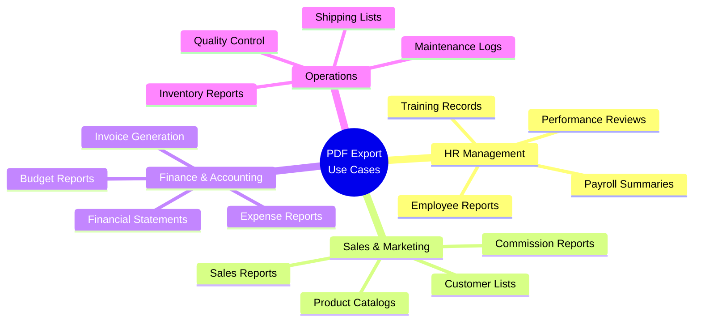
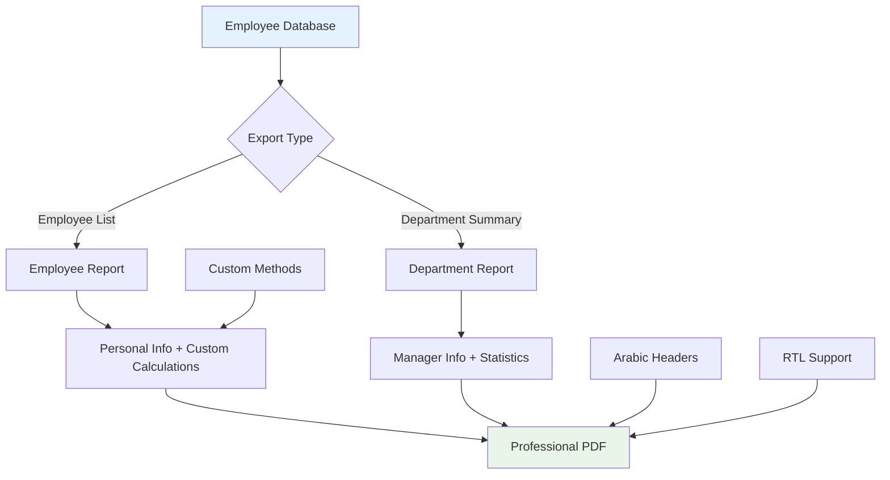
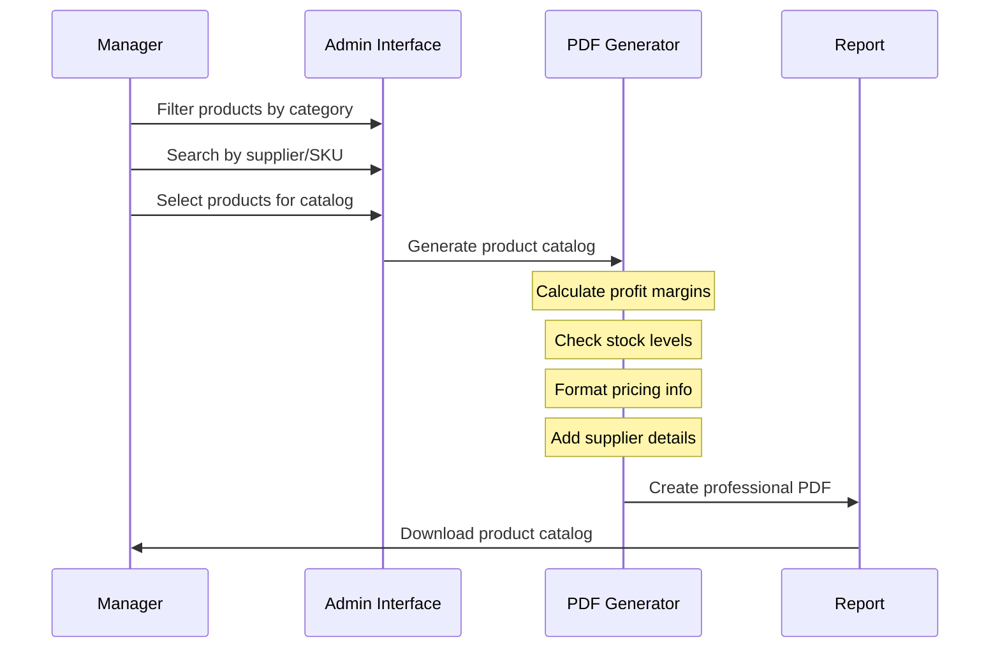
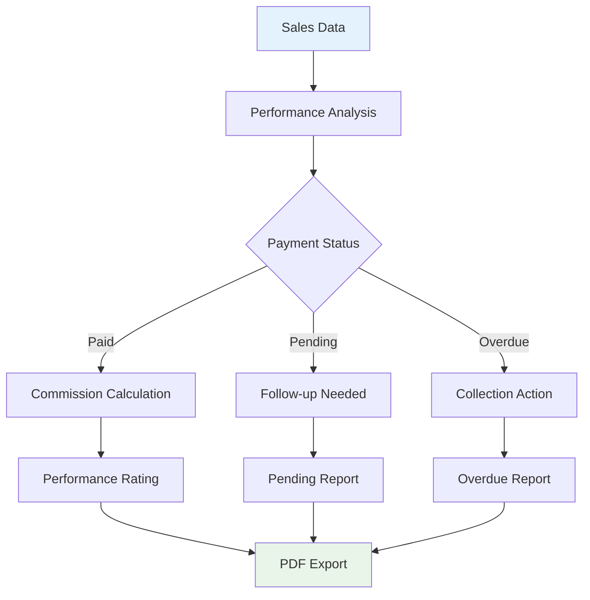
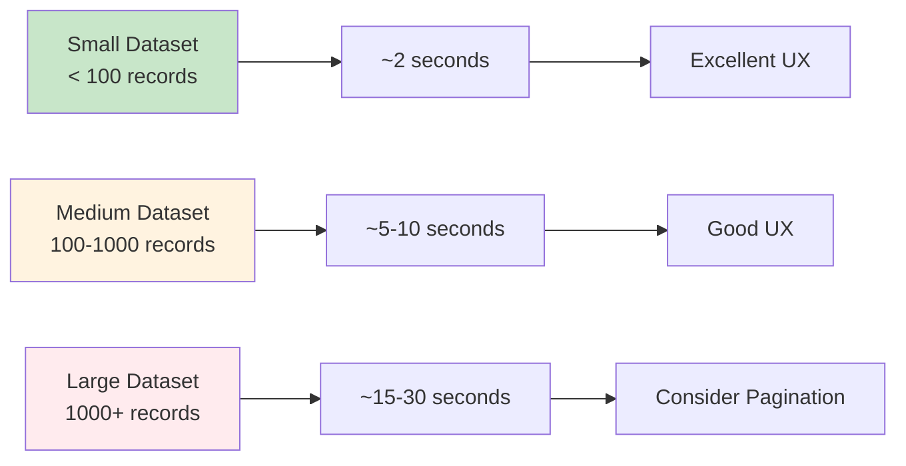

# Real-World Examples

Explore practical, real-world implementations of Django PDF Actions across different industries and use cases.

## 🏢 Business Applications Overview



## 📊 Example 1: HR Employee Management System

### Model Structure

```python
# models.py
from django.db import models
from django.contrib.auth.models import User

class Department(models.Model):
    name = models.CharField(max_length=100)
    code = models.CharField(max_length=10, unique=True)
    manager = models.ForeignKey('Employee', on_delete=models.SET_NULL, null=True, blank=True)
    budget = models.DecimalField(max_digits=12, decimal_places=2)
    
    def __str__(self):
        return self.name

class Employee(models.Model):
    STATUS_CHOICES = [
        ('active', 'Active'),
        ('inactive', 'Inactive'),
        ('vacation', 'On Vacation'),
        ('terminated', 'Terminated'),
    ]
    
    employee_id = models.CharField(max_length=20, unique=True)
    user = models.OneToOneField(User, on_delete=models.CASCADE)
    department = models.ForeignKey(Department, on_delete=models.CASCADE)
    position = models.CharField(max_length=100)
    hire_date = models.DateField()
    salary = models.DecimalField(max_digits=10, decimal_places=2)
    status = models.CharField(max_length=20, choices=STATUS_CHOICES, default='active')
    manager = models.ForeignKey('self', on_delete=models.SET_NULL, null=True, blank=True)
    
    def __str__(self):
        return f"{self.user.first_name} {self.user.last_name}"
```

### Admin Configuration with Custom Methods

```python
# admin.py
from django.contrib import admin
from django.utils.html import format_html
from django_pdf_actions.actions import export_to_pdf_landscape, export_to_pdf_portrait
from .models import Employee, Department
from datetime import date

@admin.register(Employee)
class EmployeeAdmin(admin.ModelAdmin):
    list_display = (
        'employee_id', 'get_full_name', 'get_email', 'department',
        'position', 'get_tenure', 'get_salary_range', 'status'
    )
    list_filter = ('department', 'status', 'hire_date', 'position')
    search_fields = ('employee_id', 'user__first_name', 'user__last_name', 'user__email')
    
    def get_full_name(self, obj):
        """Get employee's full name"""
        return f"{obj.user.first_name} {obj.user.last_name}"
    get_full_name.short_description = 'نام کامل'  # Arabic: Full Name
    get_full_name.admin_order_field = 'user__last_name'
    
    def get_email(self, obj):
        """Get employee's email"""
        return obj.user.email
    get_email.short_description = 'ایمیل'  # Arabic: Email
    get_email.admin_order_field = 'user__email'
    
    def get_tenure(self, obj):
        """Calculate years of service"""
        today = date.today()
        tenure = today - obj.hire_date
        years = tenure.days // 365
        months = (tenure.days % 365) // 30
        
        if years > 0:
            return f"{years}y {months}m"
        else:
            return f"{months}m"
    get_tenure.short_description = 'مدت خدمت'  # Arabic: Service Period
    
    def get_salary_range(self, obj):
        """Categorize salary into ranges"""
        if obj.salary < 50000:
            return "Entry Level ($0-50K)"
        elif obj.salary < 100000:
            return "Mid Level ($50K-100K)"
        elif obj.salary < 150000:
            return "Senior Level ($100K-150K)"
        else:
            return "Executive Level ($150K+)"
    get_salary_range.short_description = 'Salary Range'
    
    actions = [export_to_pdf_landscape, export_to_pdf_portrait]

@admin.register(Department)
class DepartmentAdmin(admin.ModelAdmin):
    list_display = (
        'code', 'name', 'get_manager_name', 'get_employee_count',
        'get_budget_formatted', 'get_avg_salary'
    )
    
    def get_manager_name(self, obj):
        """Get department manager name"""
        if obj.manager:
            return f"{obj.manager.user.first_name} {obj.manager.user.last_name}"
        return "No Manager Assigned"
    get_manager_name.short_description = 'مدیر بخش'  # Arabic: Department Manager
    
    def get_employee_count(self, obj):
        """Count employees in department"""
        count = obj.employee_set.filter(status='active').count()
        return f"{count} employees"
    get_employee_count.short_description = 'Employee Count'
    
    def get_budget_formatted(self, obj):
        """Format budget with currency"""
        return f"${obj.budget:,.2f}"
    get_budget_formatted.short_description = 'Budget'
    
    def get_avg_salary(self, obj):
        """Calculate average salary in department"""
        from django.db.models import Avg
        avg = obj.employee_set.filter(status='active').aggregate(Avg('salary'))['salary__avg']
        if avg:
            return f"${avg:,.0f}"
        return "N/A"
    get_avg_salary.short_description = 'Avg Salary'
    
    actions = [export_to_pdf_landscape, export_to_pdf_portrait]
```

### Data Flow Visualization



## 🛒 Example 2: E-Commerce Product Catalog

### Models for Product Management

```python
# models.py
class Category(models.Model):
    name = models.CharField(max_length=100)
    description = models.TextField(blank=True)
    
    def __str__(self):
        return self.name

class Supplier(models.Model):
    name = models.CharField(max_length=100)
    contact_email = models.EmailField()
    phone = models.CharField(max_length=20)
    country = models.CharField(max_length=50)
    
    def __str__(self):
        return self.name

class Product(models.Model):
    STOCK_STATUS = [
        ('in_stock', 'In Stock'),
        ('low_stock', 'Low Stock'),
        ('out_of_stock', 'Out of Stock'),
        ('discontinued', 'Discontinued'),
    ]
    
    sku = models.CharField(max_length=50, unique=True)
    name = models.CharField(max_length=200)
    category = models.ForeignKey(Category, on_delete=models.CASCADE)
    supplier = models.ForeignKey(Supplier, on_delete=models.CASCADE)
    cost_price = models.DecimalField(max_digits=10, decimal_places=2)
    selling_price = models.DecimalField(max_digits=10, decimal_places=2)
    stock_quantity = models.PositiveIntegerField()
    reorder_level = models.PositiveIntegerField(default=10)
    status = models.CharField(max_length=20, choices=STOCK_STATUS, default='in_stock')
    created_date = models.DateTimeField(auto_now_add=True)
    
    def __str__(self):
        return self.name
```

### Advanced Admin with Business Logic

```python
# admin.py
@admin.register(Product)
class ProductAdmin(admin.ModelAdmin):
    list_display = (
        'sku', 'name', 'category', 'get_supplier_info',
        'get_pricing_info', 'get_stock_status', 'get_profit_margin',
        'get_stock_value', 'get_reorder_needed'
    )
    list_filter = ('category', 'supplier', 'status', 'created_date')
    search_fields = ('sku', 'name', 'supplier__name')
    
    def get_supplier_info(self, obj):
        """Get supplier name and country"""
        return f"{obj.supplier.name} ({obj.supplier.country})"
    get_supplier_info.short_description = 'مورد تامین'  # Arabic: Supplier
    
    def get_pricing_info(self, obj):
        """Show cost and selling price"""
        return f"Cost: ${obj.cost_price} | Sale: ${obj.selling_price}"
    get_pricing_info.short_description = 'Pricing'
    
    def get_stock_status(self, obj):
        """Enhanced stock status with quantity"""
        status_emoji = {
            'in_stock': '✅',
            'low_stock': '⚠️',
            'out_of_stock': '❌',
            'discontinued': '🚫'
        }
        emoji = status_emoji.get(obj.status, '❓')
        return f"{emoji} {obj.get_status_display()} ({obj.stock_quantity})"
    get_stock_status.short_description = 'حالت موجودی'  # Arabic: Stock Status
    
    def get_profit_margin(self, obj):
        """Calculate profit margin percentage"""
        if obj.cost_price > 0:
            margin = ((obj.selling_price - obj.cost_price) / obj.cost_price) * 100
            return f"{margin:.1f}%"
        return "N/A"
    get_profit_margin.short_description = 'Profit %'
    
    def get_stock_value(self, obj):
        """Calculate total stock value"""
        value = obj.stock_quantity * obj.cost_price
        return f"${value:,.2f}"
    get_stock_value.short_description = 'Stock Value'
    
    def get_reorder_needed(self, obj):
        """Check if reorder is needed"""
        if obj.stock_quantity <= obj.reorder_level:
            return f"🔴 Reorder Now!"
        else:
            remaining = obj.stock_quantity - obj.reorder_level
            return f"🟢 OK (+{remaining})"
    get_reorder_needed.short_description = 'سفارش مجدد'  # Arabic: Reorder
    
    actions = [export_to_pdf_landscape, export_to_pdf_portrait]
```

### Product Catalog Workflow



## 📈 Example 3: Sales Analytics Dashboard

### Sales Models with Analytics

```python
# models.py
class Customer(models.Model):
    name = models.CharField(max_length=100)
    email = models.EmailField()
    phone = models.CharField(max_length=20)
    company = models.CharField(max_length=100, blank=True)
    registration_date = models.DateTimeField(auto_now_add=True)
    
    def __str__(self):
        return self.name

class Sale(models.Model):
    PAYMENT_STATUS = [
        ('pending', 'Pending'),
        ('paid', 'Paid'),
        ('overdue', 'Overdue'),
        ('cancelled', 'Cancelled'),
    ]
    
    sale_id = models.CharField(max_length=20, unique=True)
    customer = models.ForeignKey(Customer, on_delete=models.CASCADE)
    salesperson = models.ForeignKey(Employee, on_delete=models.CASCADE)
    sale_date = models.DateTimeField()
    total_amount = models.DecimalField(max_digits=12, decimal_places=2)
    commission_rate = models.DecimalField(max_digits=5, decimal_places=2, default=5.0)
    payment_status = models.CharField(max_length=20, choices=PAYMENT_STATUS, default='pending')
    notes = models.TextField(blank=True)
    
    def __str__(self):
        return f"Sale {self.sale_id}"
```

### Sales Analytics Admin

```python
@admin.register(Sale)
class SaleAdmin(admin.ModelAdmin):
    list_display = (
        'sale_id', 'get_customer_info', 'get_salesperson_name',
        'sale_date', 'get_amount_formatted', 'get_commission_amount',
        'payment_status', 'get_days_since_sale', 'get_performance_indicator'
    )
    list_filter = ('payment_status', 'sale_date', 'salesperson', 'customer')
    search_fields = ('sale_id', 'customer__name', 'salesperson__user__first_name')
    date_hierarchy = 'sale_date'
    
    def get_customer_info(self, obj):
        """Get customer name and company"""
        company = f" ({obj.customer.company})" if obj.customer.company else ""
        return f"{obj.customer.name}{company}"
    get_customer_info.short_description = 'مشتری'  # Arabic: Customer
    
    def get_salesperson_name(self, obj):
        """Get salesperson full name"""
        return f"{obj.salesperson.user.first_name} {obj.salesperson.user.last_name}"
    get_salesperson_name.short_description = 'فروشنده'  # Arabic: Salesperson
    
    def get_amount_formatted(self, obj):
        """Format sale amount with currency"""
        return f"${obj.total_amount:,.2f}"
    get_amount_formatted.short_description = 'مبلغ فروش'  # Arabic: Sale Amount
    
    def get_commission_amount(self, obj):
        """Calculate commission amount"""
        commission = (obj.total_amount * obj.commission_rate) / 100
        return f"${commission:,.2f} ({obj.commission_rate}%)"
    get_commission_amount.short_description = 'Commission'
    
    def get_days_since_sale(self, obj):
        """Calculate days since sale"""
        from django.utils import timezone
        days = (timezone.now().date() - obj.sale_date.date()).days
        return f"{days} days ago"
    get_days_since_sale.short_description = 'Age'
    
    def get_performance_indicator(self, obj):
        """Performance indicator based on amount and payment status"""
        if obj.payment_status == 'paid' and obj.total_amount > 10000:
            return "⭐ Excellent"
        elif obj.payment_status == 'paid' and obj.total_amount > 5000:
            return "✅ Good"
        elif obj.payment_status == 'pending':
            return "⏳ Pending"
        elif obj.payment_status == 'overdue':
            return "🔴 Attention"
        else:
            return "❌ Issue"
    get_performance_indicator.short_description = 'Status'
    
    actions = [export_to_pdf_landscape, export_to_pdf_portrait]
```

### Sales Performance Analysis



## 🎨 Customization Examples

### RTL Language Support Setup

For Arabic/Persian content, configure your settings:

```python
# Through Django Admin > Export PDF Settings
{
    'title': 'تقرير الموظفين',  # Arabic: Employee Report
    'rtl_support': True,
    'font_name': 'Cairo-Regular.ttf',  # Arabic font
    'header_alignment': 'RIGHT',
    'content_alignment': 'RIGHT',
    'title_alignment': 'CENTER'
}
```

### Multi-Language Headers Example

```python
class BilingualProductAdmin(admin.ModelAdmin):
    list_display = (
        'sku', 'get_name_bilingual', 'get_price_with_currency',
        'get_category_bilingual', 'stock_quantity'
    )
    
    def get_name_bilingual(self, obj):
        return f"{obj.name_en} | {obj.name_ar}"
    get_name_bilingual.short_description = 'Product Name | اسم المنتج'
    
    def get_price_with_currency(self, obj):
        return f"${obj.price} | {obj.price * 3.75:.2f} ريال"
    get_price_with_currency.short_description = 'Price USD | السعر ريال'
    
    def get_category_bilingual(self, obj):
        return f"{obj.category.name_en} | {obj.category.name_ar}"
    get_category_bilingual.short_description = 'Category | الفئة'
```

## 📊 Performance Comparison

### Export Performance by Data Size



## 🎯 Best Practices Summary

!!! tip "Implementation Tips"
    
    === "🗂️ Data Organization"
        - Use meaningful field names in `list_display`
        - Group related custom methods together
        - Implement proper `admin_order_field` for sorting
    
    === "🌐 Internationalization"
        - Use Arabic headers for person-related fields
        - English for technical/system fields
        - Enable RTL support for Arabic content
    
    === "📈 Performance"
        - Limit custom method complexity
        - Use `select_related()` for foreign keys
        - Consider pagination for large datasets
    
    === "🎨 User Experience"
        - Choose appropriate orientation (landscape vs portrait)
        - Use consistent formatting in custom methods
        - Add visual indicators (emojis, status colors)

## 🚀 Next Steps

Ready to implement these examples in your project?

1. [Configure Advanced Settings →](settings.md)
2. [Learn Custom Admin Methods →](custom-methods.md)
3. [Check API Reference →](api/actions.md)

---

!!! success "Professional Results!"
    These examples demonstrate how Django PDF Actions can transform your admin interface into a powerful business reporting tool! 