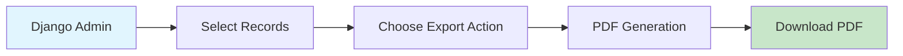
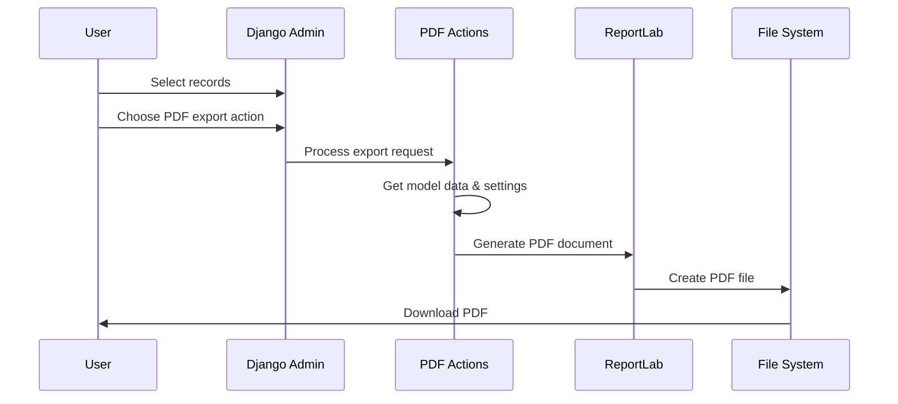
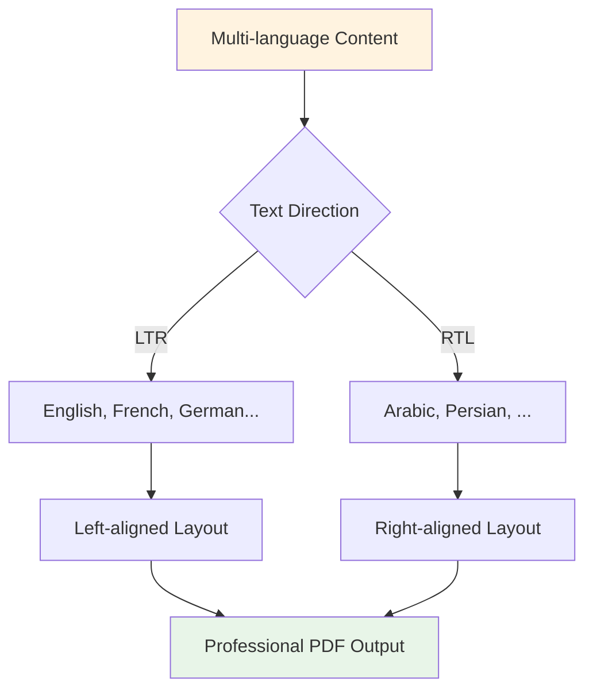
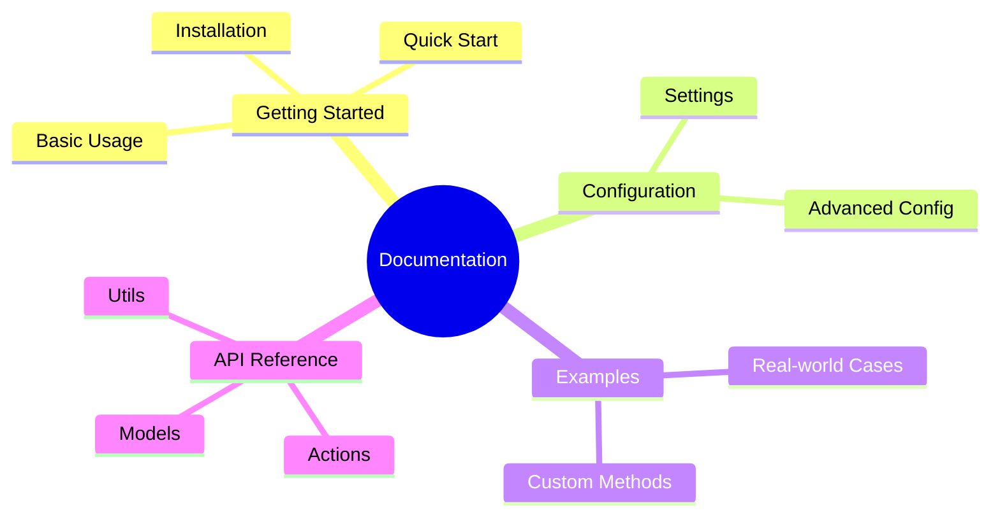

# Django PDF Actions

<div align="center">
  
  
  **A powerful Django application for generating PDF exports from the Django admin interface**
</div>

---

[](https://pypi.org/project/django-pdf-actions/)
[](https://pypi.org/project/django-pdf-actions/)
[](https://pypi.org/project/django-pdf-actions/)
[](https://opensource.org/licenses/MIT)
[](https://pypistats.org/packages/django-pdf-actions)

## 🚀 Overview

Transform your Django admin interface into a powerful PDF export engine! Django PDF Actions seamlessly integrates professional PDF generation capabilities into your existing Django models with minimal configuration.



## ✨ Key Features

=== "🎯 Easy Integration"
    
    Add PDF export to any Django model with just 2 lines of code:
    
    ```python
    actions = [export_to_pdf_landscape, export_to_pdf_portrait]
    ```

=== "🎨 Beautiful Design"
    
    - Professional layouts with customizable styling
    - Company branding with logos and headers
    - Multiple page orientations and sizes
    - RTL language support (Arabic, Persian)

=== "⚡ Performance"
    
    - Efficient handling of large datasets
    - Optimized memory usage
    - Background processing for large exports
    - Pagination for better performance

=== "🔧 Flexible"
    
    - Custom admin methods support
    - Configurable fonts and colors  
    - Multiple export formats
    - Advanced table styling

## 🏃‍♂️ Quick Start

Get up and running in 60 seconds:

```bash
# 1. Install the package
pip install django-pdf-actions

# 2. Add to your settings
INSTALLED_APPS = [
    # ...
    'django_pdf_actions',
]

# 3. Run migrations
python manage.py migrate
```

```python
# 4. Add to your admin.py
from django_pdf_actions.actions import export_to_pdf_landscape, export_to_pdf_portrait

@admin.register(YourModel)
class YourModelAdmin(admin.ModelAdmin):
    list_display = ('name', 'email', 'created_at')
    actions = [export_to_pdf_landscape, export_to_pdf_portrait]
```

!!! success "That's it!"
    Your Django admin now has professional PDF export capabilities!

## 🔄 How It Works



## 🌍 Internationalization Support

Perfect for global applications with built-in RTL support:



## 📊 Use Cases

!!! example "Real-World Applications"
    
    === "📋 Reports"
        - Employee lists
        - Sales reports  
        - Inventory management
        - Financial statements
    
    === "📄 Documents"
        - Invoices and receipts
        - Certificates
        - ID cards
        - Product catalogs
    
    === "📈 Analytics"
        - Data exports
        - Performance reports
        - Survey results
        - Customer lists

## 🎯 Perfect For

- **Businesses** needing professional document generation
- **Developers** wanting quick PDF export functionality  
- **Multi-language** applications requiring RTL support
- **Large datasets** requiring optimized performance

## 🛠️ Technical Specifications

| Feature | Specification |
|---------|--------------|
| **Python** | 3.8+ |
| **Django** | 3.2+ |
| **PDF Engine** | ReportLab |
| **Languages** | Unicode support, RTL languages |
| **File Sizes** | Optimized for large datasets |
| **Performance** | Memory-efficient processing |

## 📚 Documentation Structure



## 🤝 Community & Support

- 💬 [GitHub Discussions](https://github.com/ibrahimroshdy/django-pdf-actions/discussions)
- 🐛 [Issue Tracker](https://github.com/ibrahimroshdy/django-pdf-actions/issues)
- 📖 [Documentation](https://ibrahimroshdy.github.io/django-pdf-actions/)
- 📦 [PyPI Package](https://pypi.org/project/django-pdf-actions/)

## 📄 License

This project is licensed under the MIT License - see the [LICENSE](https://github.com/ibrahimroshdy/django-pdf-actions/blob/main/LICENSE) file for details.

---

<div align="center">
  <strong>Ready to transform your Django admin? Let's get started!</strong>
  
  [Get Started →](installation.md){ .md-button .md-button--primary }
  [View Examples →](examples.md){ .md-button }
</div>
