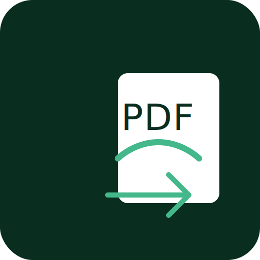

# Installation Guide

<p align="center">
  
</p>

## Prerequisites

Before installing Django PDF Export, ensure you have:

- Python 3.8 or higher
- Django 3.2 or higher
- pip (Python package installer)

### Technical Requirements
- **PDF Engine**: ReportLab (automatically installed)
- **Character Encoding**: UTF-8
- **Default Paper Size**: A4
- **Disk Space**: Minimal (~30MB including fonts)
- **Memory**: Depends on the size of exported data

## Installation Methods

### Using pip (Recommended)

The easiest way to install Django PDF Export is using pip:

```bash
pip install django-pdf-actions
```

### From Source

If you want to install the latest development version:

```bash
git clone https://github.com/ibrahimroshdy/django-pdf-actions.git
cd django-pdf-actions
pip install -e .
```

## Configuration

### 1. Add to INSTALLED_APPS

Add 'django_pdf_actions' to your `INSTALLED_APPS` in `settings.py`:

```python
INSTALLED_APPS = [
    ...
    'django_pdf_actions',
]
```

### 2. Run Migrations

Apply the database migrations:

```bash
python manage.py migrate
```

### 3. Set up Fonts

The package uses fonts from your project's `static/assets/fonts` directory. Here's how to set them up:

1. Create the fonts directory:
```bash
mkdir -p static/assets/fonts
```

2. Install the default font (DejaVu Sans):
```bash
python manage.py setup_fonts
```

3. Add custom fonts (optional):
```bash
# Example: Installing Roboto font
python manage.py setup_fonts --font-url "https://github.com/google/fonts/raw/main/apache/roboto/Roboto-Regular.ttf" --font-name "Roboto-Regular.ttf"

# Example: Installing Cairo font for Arabic support
python manage.py setup_fonts --font-url "https://github.com/google/fonts/raw/main/ofl/cairo/Cairo-Regular.ttf" --font-name "Cairo-Regular.ttf"
```

### Font Directory Structure

After setup, your project should have this structure:
```
your_project/
├── static/
│   └── assets/
│       └── fonts/
│           ├── DejaVuSans.ttf
│           ├── Roboto-Regular.ttf (optional)
│           └── Cairo-Regular.ttf (optional)
```

### 4. Configure Static Files

Ensure your Django project is configured to serve static files:

1. Add static files settings to your `settings.py`:
```python
STATIC_URL = '/static/'
STATIC_ROOT = os.path.join(BASE_DIR, 'staticfiles')
STATICFILES_DIRS = [
    os.path.join(BASE_DIR, 'static'),
]
```

2. Run collectstatic:
```bash
python manage.py collectstatic
```

## Verify Installation

To verify the installation:

1. Start your Django development server:
```bash
python manage.py runserver
```

2. Navigate to the Django admin interface
3. Select any model with list view
4. You should see "Export to PDF (Portrait)" and "Export to PDF (Landscape)" in the actions dropdown

### Troubleshooting

If you encounter issues during installation:

1. Font Installation Issues:
   - Ensure your fonts directory exists at `static/assets/fonts/`
   - Verify font files are in TTF format
   - Check file permissions
   - Run `python manage.py collectstatic` after adding fonts

2. PDF Generation Issues:
   - Ensure your model fields are properly defined in list_display
   - Check that an active PDF Export Settings configuration exists
   - Verify logo file paths if using custom logos

3. Database Issues:
   - Ensure migrations are applied correctly
   - Check database permissions
   - Verify Django database settings

4. Static Files Issues:
   - Verify STATIC_URL and STATIC_ROOT settings
   - Ensure collectstatic command was run
   - Check web server configuration for static files

## Next Steps

- Check out the [Quick Start Guide](quickstart.md) to begin using the package
- Configure your [PDF Export Settings](settings.md)