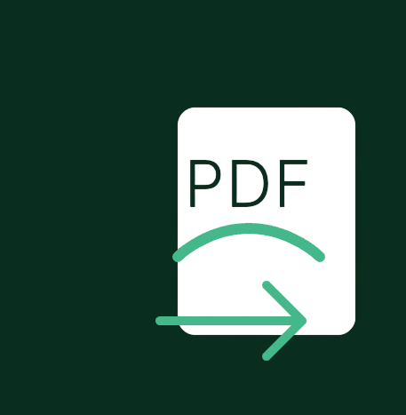

# Quick Start Guide

<p align="center">
  
</p>

This guide will help you get started with Django PDF Export quickly.

## Basic Setup

### 1. Install the Package

```bash
pip install django-pdf-actions
```

### 2. Update INSTALLED_APPS

Add to your Django settings:

```python
INSTALLED_APPS = [
    ...
    'django_pdf_actions',
]
```

### 3. Run Migrations

```bash
python manage.py migrate
```

## Adding Export Actions

### 1. Import Actions

In your `admin.py`:

```python
from django.contrib import admin
from django_pdf_actions.actions import export_to_pdf_landscape, export_to_pdf_portrait
```

### 2. Add to ModelAdmin

```python
@admin.register(YourModel)
class YourModelAdmin(admin.ModelAdmin):
    list_display = ('id', 'name', 'created_at')  # Your fields
    actions = [export_to_pdf_landscape, export_to_pdf_portrait]
```

## Basic Usage

1. Go to your model's list view in Django admin
2. Select the records you want to export
3. Choose either:
   - "Export to PDF (Portrait)"
   - "Export to PDF (Landscape)"
4. Click "Go"
5. Your PDF will download automatically

## Example Configuration

### 1. Create Export Settings

1. Go to Admin > Django PDF > Export PDF Settings
2. Click "Add Export PDF Settings"
3. Configure basic settings:
   ```python
   {
       'title': 'My Export Settings',
       'header_font_size': 12,
       'body_font_size': 8,
       'page_margin_mm': 20,
       'items_per_page': 15
   }
   ```
4. Mark as active
5. Save

### 2. Test the Export

1. Go to your model's admin list view
2. Select a few records
3. Try both portrait and landscape exports

## Next Steps

- Configure [Custom Settings](settings.md) 
