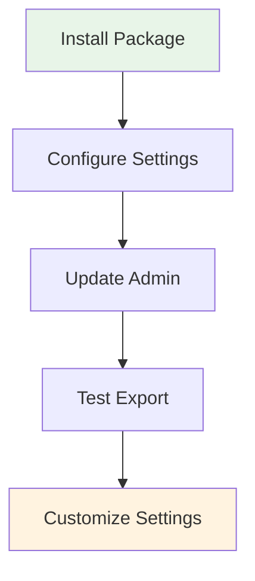
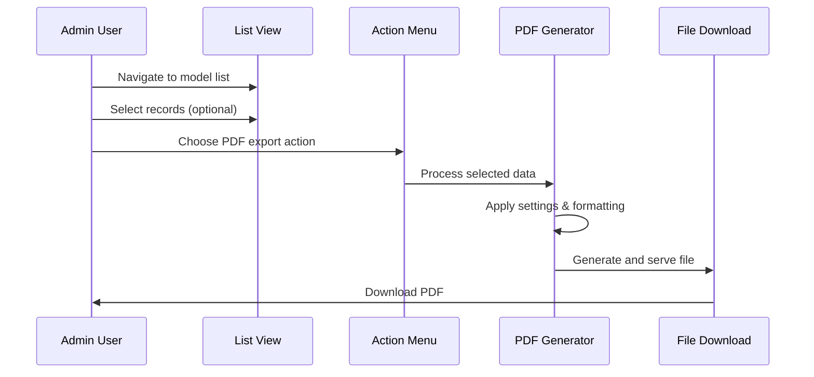
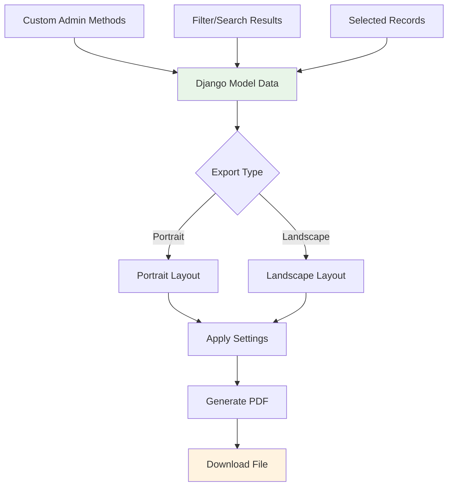
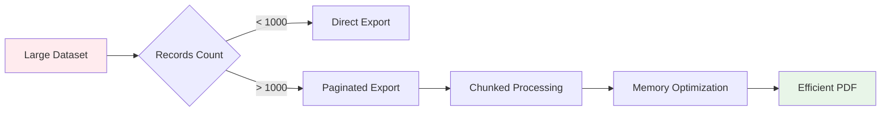

# Basic Usage Guide

Learn how to effectively use Django PDF Actions in your projects with practical examples and best practices.

## 🎯 Getting Started

### Step-by-Step Integration



### 1. Basic Model Setup

Let's start with a simple Employee model:

```python
# models.py
from django.db import models

class Employee(models.Model):
    first_name = models.CharField(max_length=50)
    last_name = models.CharField(max_length=50)
    email = models.EmailField()
    department = models.CharField(max_length=100)
    hire_date = models.DateField()
    salary = models.DecimalField(max_digits=10, decimal_places=2)
    
    def __str__(self):
        return f"{self.first_name} {self.last_name}"
```

### 2. Admin Configuration

```python
# admin.py
from django.contrib import admin
from django_pdf_actions.actions import export_to_pdf_landscape, export_to_pdf_portrait
from .models import Employee

@admin.register(Employee)
class EmployeeAdmin(admin.ModelAdmin):
    list_display = (
        'first_name', 'last_name', 'email', 
        'department', 'hire_date', 'salary'
    )
    list_filter = ('department', 'hire_date')
    search_fields = ('first_name', 'last_name', 'email')
    
    # Add PDF export actions
    actions = [export_to_pdf_landscape, export_to_pdf_portrait]
```

!!! tip "Pro Tip"
    Always include the fields you want in your PDF in the `list_display` tuple!

## 🚀 Basic Export Process

### Admin Interface Workflow



### Export Options

=== "🖼️ Landscape Export"
    
    **Best for:** Wide tables with many columns
    
    ```python
    actions = [export_to_pdf_landscape]
    ```
    
    - **Page Size:** A4 Landscape (297mm × 210mm)
    - **Columns:** More space for wider tables
    - **Use Case:** Reports with many fields

=== "📄 Portrait Export"
    
    **Best for:** Standard documents with fewer columns
    
    ```python
    actions = [export_to_pdf_portrait]
    ```
    
    - **Page Size:** A4 Portrait (210mm × 297mm)
    - **Rows:** More rows per page
    - **Use Case:** Standard lists and catalogs

## 📊 Advanced Usage Examples

### Custom Admin Methods

You can include custom admin methods in your PDF exports:

```python
@admin.register(Employee)
class EmployeeAdmin(admin.ModelAdmin):
    list_display = (
        'full_name', 'email', 'department_info', 
        'years_employed', 'salary_range'
    )
    
    def full_name(self, obj):
        """Combine first and last name"""
        return f"{obj.first_name} {obj.last_name}"
    full_name.short_description = 'Full Name'
    full_name.admin_order_field = 'last_name'
    
    def department_info(self, obj):
        """Add department with location"""
        return f"{obj.department} (HQ)"
    department_info.short_description = 'Department'
    
    def years_employed(self, obj):
        """Calculate years of employment"""
        from datetime import date
        years = (date.today() - obj.hire_date).days // 365
        return f"{years} years"
    years_employed.short_description = 'Experience'
    
    def salary_range(self, obj):
        """Categorize salary range"""
        if obj.salary < 50000:
            return "Entry Level"
        elif obj.salary < 80000:
            return "Mid Level"
        else:
            return "Senior Level"
    salary_range.short_description = 'Level'
    
    actions = [export_to_pdf_landscape, export_to_pdf_portrait]
```

!!! success "Custom Methods Work!"
    All your custom admin methods will appear in the PDF export automatically!

### Multi-Language Content

For international applications with Arabic/RTL support:

```python
class Product(models.Model):
    name_en = models.CharField(max_length=100, verbose_name="Product Name")
    name_ar = models.CharField(max_length=100, verbose_name="اسم المنتج")
    price = models.DecimalField(max_digits=10, decimal_places=2)
    category = models.CharField(max_length=50)

@admin.register(Product)
class ProductAdmin(admin.ModelAdmin):
    list_display = ('name_en', 'name_ar', 'get_price_formatted', 'category')
    
    def get_price_formatted(self, obj):
        return f"${obj.price:.2f}"
    get_price_formatted.short_description = 'السعر'  # Arabic: Price
    
    actions = [export_to_pdf_landscape, export_to_pdf_portrait]
```

## 🎨 Customization Examples

### Basic Settings Configuration

Create your PDF export settings through the Django admin:

1. Navigate to **Admin > Django PDF Actions > Export PDF Settings**
2. Click **"Add Export PDF Settings"**
3. Configure your settings:

```python
# Example settings (configured via admin interface)
{
    'title': 'Employee Report',
    'header_font_size': 12,
    'body_font_size': 9,
    'page_margin_mm': 20,
    'items_per_page': 25,
    'show_logo': True,
    'rtl_support': False,  # Set to True for Arabic/RTL languages
    'header_background_color': '#4A90E2',
    'grid_line_color': '#CCCCCC'
}
```

### Export Flow Visualization



## 📋 Common Use Cases

### 1. Employee Directory

```python
class EmployeeAdmin(admin.ModelAdmin):
    list_display = (
        'employee_id', 'full_name', 'department', 
        'email', 'phone', 'hire_date', 'status'
    )
    list_filter = ('department', 'status', 'hire_date')
    actions = [export_to_pdf_portrait]  # Portrait for employee lists
```

### 2. Sales Report

```python
class SaleAdmin(admin.ModelAdmin):
    list_display = (
        'sale_date', 'customer_name', 'product', 
        'quantity', 'unit_price', 'total_amount', 'commission'
    )
    actions = [export_to_pdf_landscape]  # Landscape for financial data
```

### 3. Inventory Report

```python
class ProductAdmin(admin.ModelAdmin):
    list_display = (
        'sku', 'name', 'category', 'stock_quantity', 
        'reorder_level', 'supplier', 'last_updated'
    )
    actions = [export_to_pdf_landscape]
```

## 🔧 Performance Optimization

### Large Datasets



### Best Practices for Performance

!!! tip "Optimization Tips"
    
    === "📊 Data Selection"
        - Use `list_filter` to reduce dataset size
        - Implement search functionality
        - Select only necessary records
    
    === "🎯 Field Selection"
        - Include only essential fields in `list_display`
        - Avoid expensive database queries in custom methods
        - Use `select_related()` for foreign key fields
    
    === "⚙️ Settings Tuning"
        - Adjust `items_per_page` based on content
        - Use appropriate font sizes
        - Optimize page margins

### Memory-Efficient Custom Methods

```python
def get_related_data(self, obj):
    """Efficient way to get related data"""
    # Good: Uses select_related
    return obj.department.name if obj.department else "N/A"

def get_expensive_calculation(self, obj):
    """Avoid this in large exports"""
    # Bad: Expensive calculation in every row
    return SomeModel.objects.filter(related_field=obj).count()
```

## ❌ Common Mistakes to Avoid

!!! warning "Avoid These Issues"
    
    1. **Missing list_display**: Custom methods not in `list_display` won't appear
    2. **Database queries in methods**: Can cause N+1 query problems  
    3. **Large images**: Heavy logos can slow down generation
    4. **Wrong orientation**: Use landscape for wide tables, portrait for tall lists
    5. **Missing RTL settings**: Enable RTL support for Arabic/Persian content

## 🎉 Next Steps

Now that you understand the basics:

1. [Configure Advanced Settings →](settings.md)
2. [Explore Real-world Examples →](examples.md)
3. [Learn Custom Admin Methods →](custom-methods.md)

---

!!! success "You're Ready!"
    You now have everything you need to create professional PDF exports from your Django admin interface! 